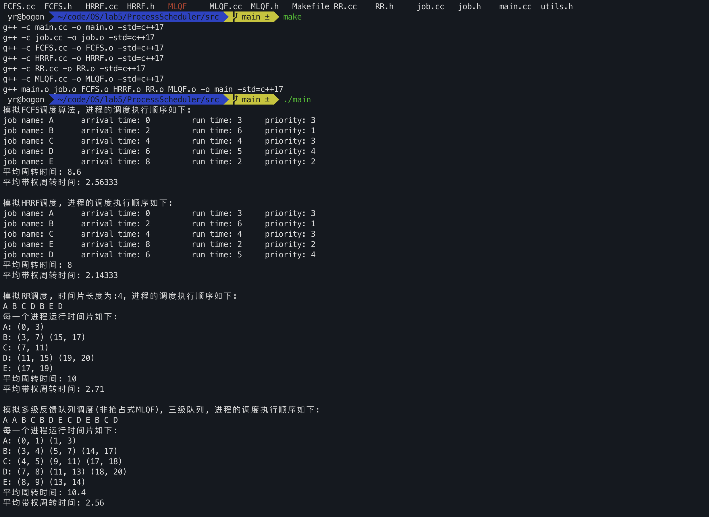
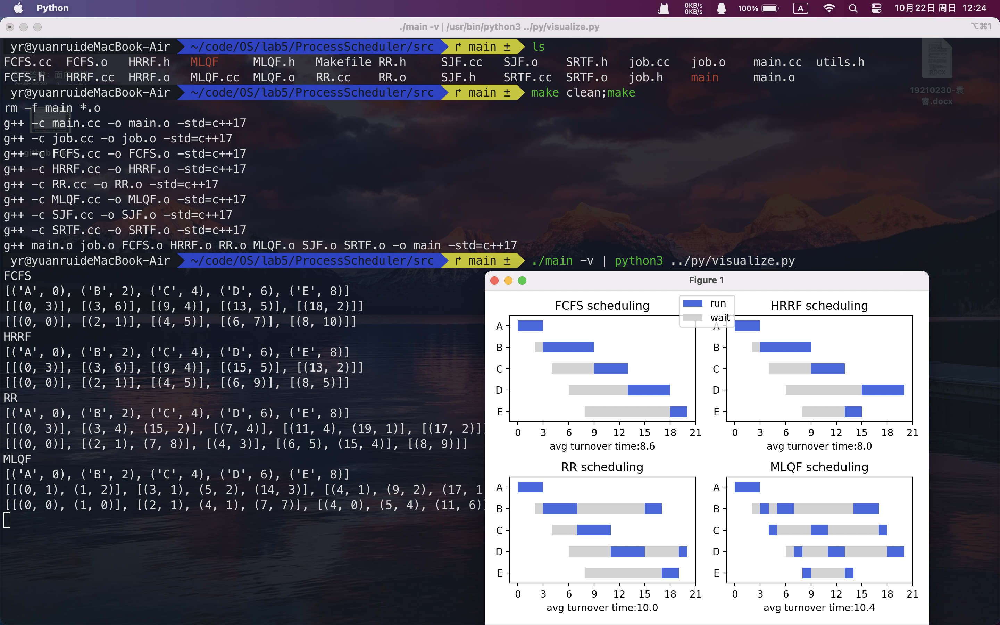

## ProcessScheduler

os lab5 进程调度模拟器

当前开发整个程序框架的雏型，较为粗糙。且当前测试用例较少。

计划：用C++完成算法得到结果字符串序列，在利用python对于结果进行简单的可视化。

### 选择1

1. FCFS ✅(实现了一个demo版本，用来演示算法模块的输入输出 by yr)
2. SJF  ✅
3. SRTF ✅
4. HRRF ✅
5. RR ✅

### 选择2

多级反馈队列调度算法 ✅

当前程序执行的演示效果：

进程间数据通信的协议定制

:调度算法|平均周转时间|平均加权周转时间|轮转时间片[ 如果有 ]/n
进程名:到达时间|开始时间-结束时间|开始时间-结束时间|.../n
进程名:到达时间|开始时间-结束时间|开始时间-结束时间|.../n
...
进程名:到达时间|开始时间-结束时间|开始时间-结束时间|.../n
/n
:调度算法|平均周转时间|平均加权周转时间|轮转时间片[ 如果有 ]/n
进程名:到达时间|开始时间-结束时间|开始时间-结束时间|.../n
进程名:到达时间|开始时间-结束时间|开始时间-结束时间|.../n
...
进程名:到达时间|开始时间-结束时间|开始时间-结束时间|.../n
/n

for example
:RR|10|2.71|4
A:0|0-1|1-3
B:2|3-4|5-7|14-17
C:4|4-5|9-11|17-18
D:6|7-8|11-13|18-20
E:8|8-9|13-14
\n

