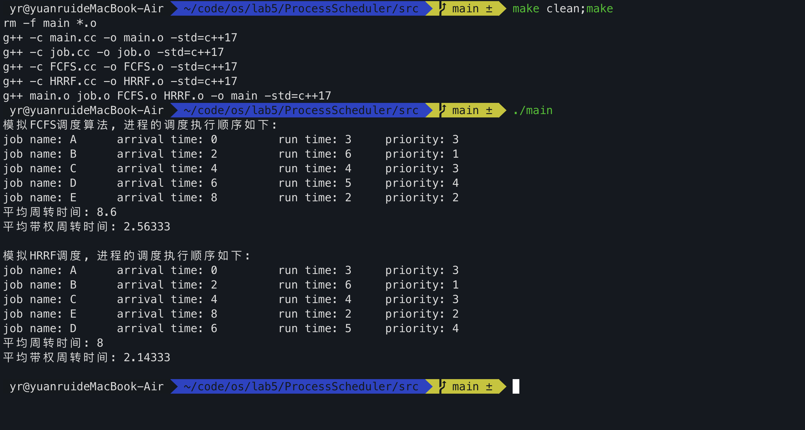

## ProcessScheduler

os lab5 进程调度模拟器

当前开发整个程序框架的雏型，较为粗糙。且当前测试用例较少。

计划：用C++完成算法得到结果字符串序列，在利用python对于结果进行简单的可视化。

### 选择1

1. FCFS ✅(实现了一个demo版本，用来演示算法模块的输入输出 by yr)
2. SJF
3. SRTF
4. HRRF ✅
5. RR ✅

### 选择2

多级反馈队列调度算法 【developing】

当前程序执行的演示效果：

